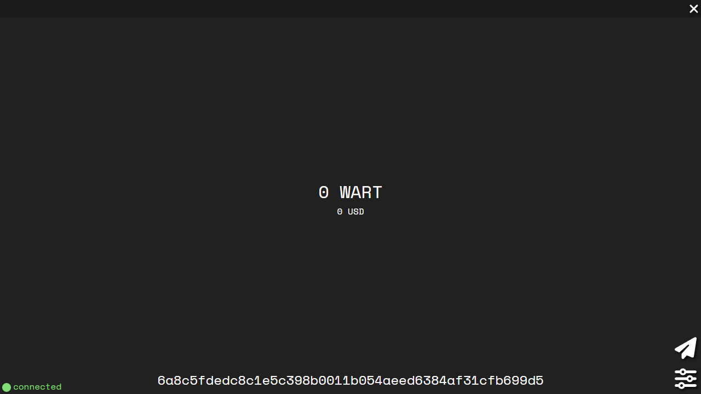

# Warthog GUI Wallet



> To use this wallet (sending txs and synchronizing balance) you'll need to provide a node to connect to. Either running locally on your machine or a node thats publicly accessible through the internet.

## Using Bundled Executables

### Requirements:

#### Windows
- [WebView2](https://go.microsoft.com/fwlink/p/?LinkId=2124703)
- [.NET](https://dotnet.microsoft.com/en-us/download/dotnet-framework/net462)

#### Linux
*tested for Ubuntu 22.04*
- `sudo apt install python3-gi python3-gi-cairo gir1.2-gtk-3.0 gir1.2-webkit2-4.1`

### Run:
Download executable for your operating system [here]().

The wallet will create a database file next to the executable when you run it.
It's best to put them in a folder like this:
```
└── MyWalletFolder
    ├── wartwallet.exe
    └── wartwallet.db
```

## Running From Source

### Requirements:
- Python 3.9 with required packages installed (requirements.txt)
- pyinstaller (if you want to bundle an executable yourself)

#### Linux only:
*tested for Ubuntu 22.04*
- `sudo apt install python3-gi python3-gi-cairo gir1.2-gtk-3.0 gir1.2-webkit2-4.1`
- `pip install PyGObject`

### Run:
`python3 main.py`

### Bundle executable yourself with pyinstaller:
To minimize executable size install requirements and run pyinstaller in a virtual environment.

*on linux* `sudo apt install binutils` *beforehand*

`pyinstaller main.spec`
